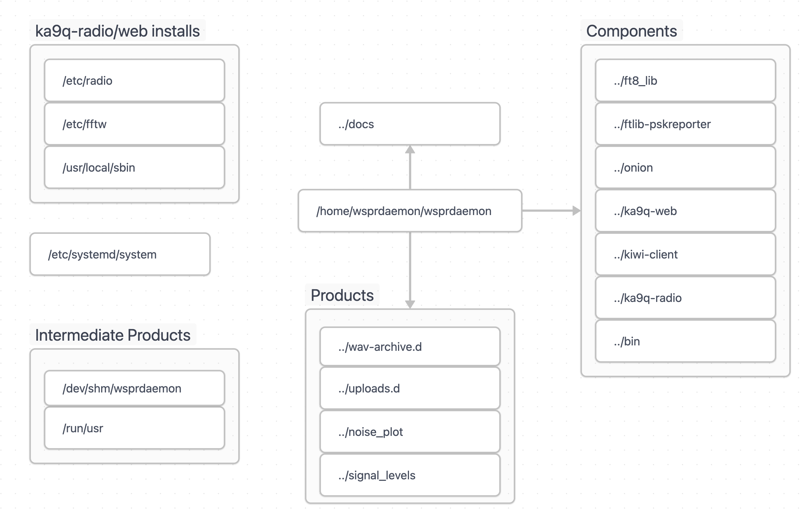
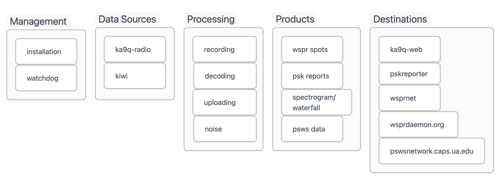
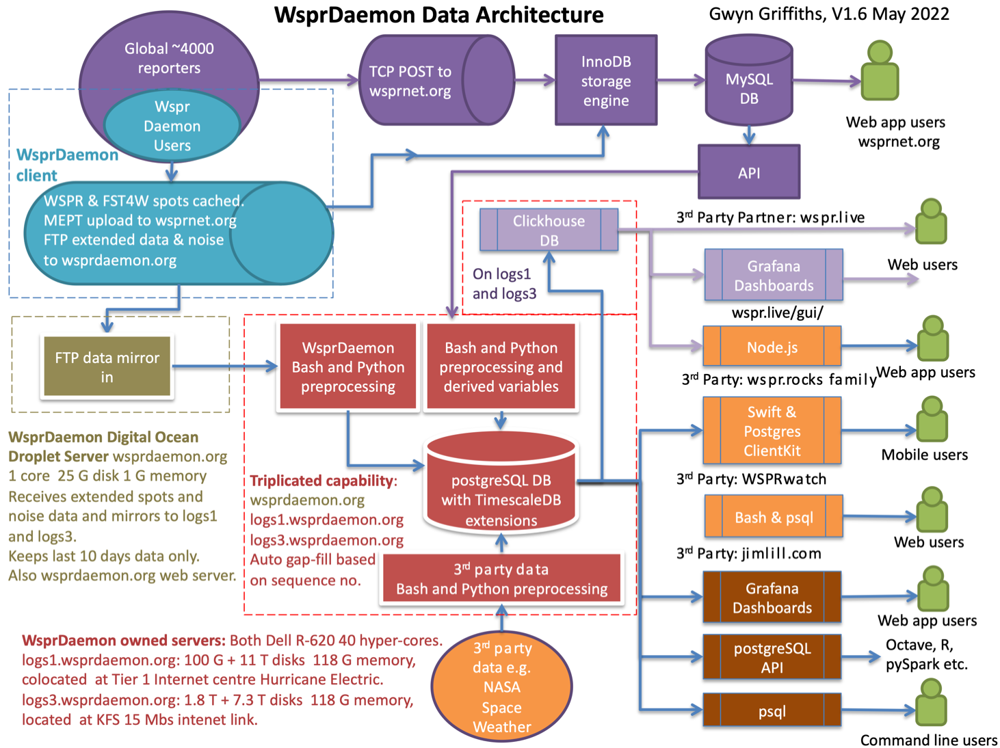

# How wsprdaemon Works

Wsprdaemon (WD) runs as a Linux service to decode WSPR and FST4W spots from one or more Kiwis and/or RX888 SDRs and reliably posts them to wsprnet.org. It includes many features not found in WSJT-x, including multiple band and/or multiple receiver support. WD also records additional information about spots like doppler shift and background noise level which permit much deeper understanding of propagation conditions. For systems like the KiwiSDR which have a limited number of receive channels, schedules can be configured to switch between bands at different hours of the day or at sunrise/sunset-relative times. Spots obtained from multiple receivers on the same band ( e.g a 40M vertical and 500' Beverage ) can be merged together with only the best SNR posted to wsprnet.org. WD can be configured to create graphs of the background noise level for display locally and/or at graphs.wsprdaemon.org.

After configuration, WD runs like a home appliance: it recovers on its own from power and internet outages and caches all spots and other data it gathers until wsprnet.org and/or wsprdaemon.net confirm delivery.  Most of the 20+ 'top spotting' sites at http://wspr.rocks/topspotters/ are running WD, and in aggregate they report about 33% of the 7+M spots recorded each day at wsprnet.org.

WD runs on almost any Debian Linux system running Ubuntu 22.04 LTS on x86. Although WD on a Pi 4 can decode 10+ bands, most sites run WD on a x86 CPU.

## Basic components

- receiver integration (KiwiSDR, ka9q-radio)
- wspr decoding and reporting to wsprnet
- grape recording, conversion to digital_rf, and reporting to HamSCI
- pskreporter

## A running instance of wsprdaemon performs several tasks:

- configuration and installation checks
- preparation of recording and posting directories
- "listening" functions for defined KIWI and KA9Q receivers
- decoding and posting wspr and fst4w spots
- recording 16 kHz I/Q around WWV and CHU broadcasts for upload to HamSCI
- monitoring and logging results and errors 

## What will make it not start or then stop working?

- data stream not defined -- wd requires at least one receiver (KIWI or KA9Q)
- schedule not defined -- wd requires a schedule definition
- wd requires a working hardware radio (KiwiSDR or RX888) with proper configuration
- [See Troubleshooting](../troubleshooting/overview.md)

## What happens to the data?

WD sends the collected data to several upstream servers (depending on configuration):
- 1. wsprdaemon.org (wspr spots and other information)
- 2. wspr.net (wspr spots only)
- 3. pskreporter.info (FT4 and FT8 spots)
- 4. pswsnetwork.caps.ua.edu (WWV/H and CHU monitoring)

A diagram of the WSPR reports:

