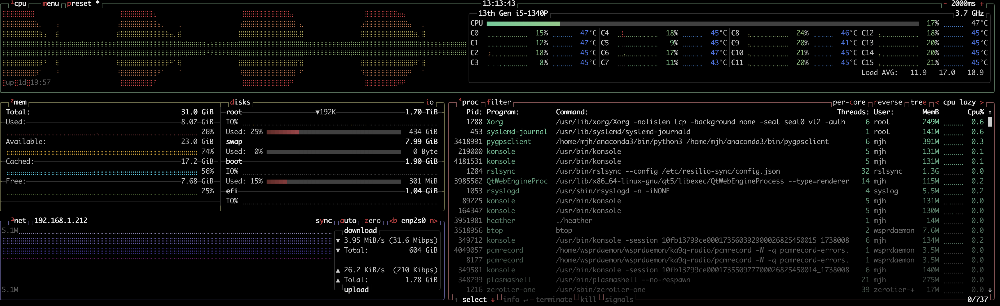

# Monitoring WD operation

## recordings

## postings

## logs

## using BTOP 

## Useful wd aliases

- *wd-query* -- usage:  wd-query {-r | -t} ID [HOURS_TO_SEARCH]       -r => search for ID of reporter     -t => search for ID of transmit beacon"
- *wd-wsprlog-check* 
- watch "ls -lt `find -name pcmrecord-errors.log`"
- *wdrl* -- show the syslog entries for the radiod service.  add -f to watch new log lines appear
- *wdln* -- watch the upload to wsprnet log
- *wdle* -- search all log files for ERROR lines