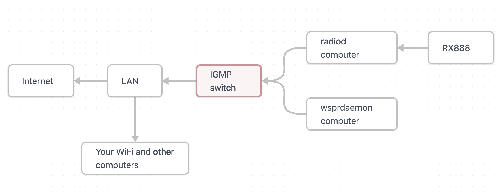

# Networking

WD using ka9q-radio typically runs on a stand-alone computer.  In this scenario, a standard ethernet or WiFi connection to the computer will suffice for remote management and for reporting. 

However, ka9q-radio uses RTP (multicast) streams to manage interprocess communications.  This means one can run ka9q-radio with a hardware radio on one computer and process the output on another. However, multicast streams produce significant network traffic -- enough to bring a WiFi network to a standstill.  

When running on a stand-alone computer, one should set the parameter ttl = 0 in radiod@.conf.  This directs radiod to put no RTP streams on the LAN.  When distributing the functions between computers, however, one sets ttl = 1 in radiod@.conf and, especially with a connected WiFi LAN, interposes an IGMP-aware ethernet switch (with IGMP snooping ON) between the computers using RTP and the rest of your network.  This will confine the RTP streams to the connections between your radiod and WD computers so they don't flood the rest of your LAN.  

