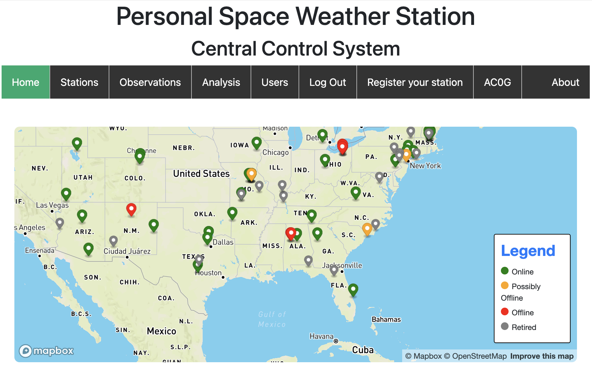
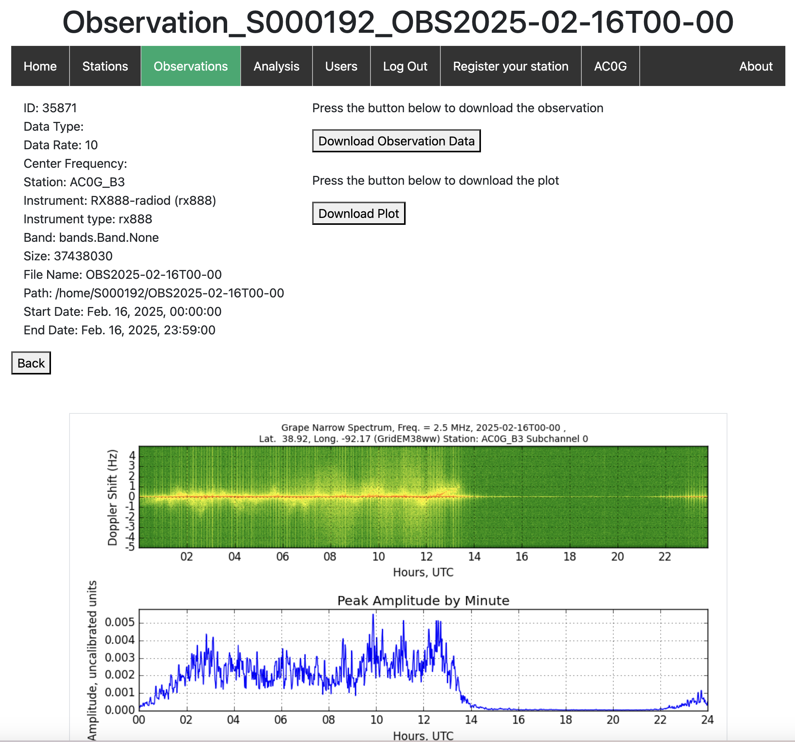

# HamSCI WWV/H and CHU Monitoring

wsprdaemon software captures data in support of the [HamSCI Personal Space Weather Station project](https://hamsci.org/psws-overview).
It makes simultaneous I/Q stream recordings of WWV, WWVH, and CHU broadcasts, converts these into digital_rf data repositories and uploads them to the [PSWS server at the University of Alabama](https://pswsnetwork.caps.ua.edu/).

