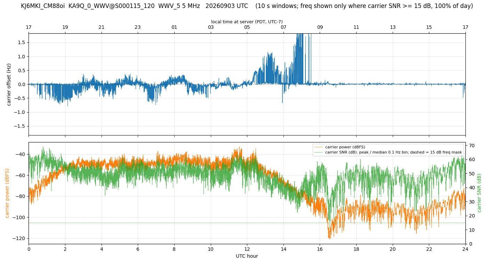

# GRAPE Carrier Strip Charts

*New in WD 3.4.6*

Every WsprDaemon site that records WWV, WWVH or CHU for the HamSCI GRAPE project already produces, shortly after 00:00 UTC, one 24 hour, 10 samples-per-second I/Q file per band (`24_hour_10sps_iq.wav`) and uploads it to the PSWS server. Until now the station owner never saw what was in that file.

Starting with WD 3.4.6, WD also turns each of those files into a **strip chart** and publishes the charts on a small web page served by the WD machine itself. Nothing needs to be configured: if your `wsprdaemon.conf` defines `GRAPE_PSWS_ID`, you have the charts.



## What the chart shows

Each chart covers one UTC day for one band, and has two panes:

- **Carrier frequency offset (Hz)**, the top pane. This is the Doppler shift of the received carrier relative to the channel center, estimated every 10 seconds from the spectral peak of the 10 sps I/Q data. Ionospheric motion at sunrise and sunset typically shows as excursions of a few tenths of a hertz; the daytime "quiet" trace shows how well your receiver's reference clock tracks WWV's cesium standard. The trace is blanked wherever the carrier is not detectable, so a gap means fade-out rather than a real frequency jump.
- **Carrier power and SNR**, the bottom pane. Carrier power (dBFS, orange, left axis) is the mean power in the ±5 Hz channel. Carrier SNR (dB, green, right axis) is the spectral peak relative to the median 0.1 Hz bin of the same window, so it separates a weak carrier from a raised noise floor. The dashed green line is the 15 dB threshold below which the frequency trace above is blanked.

The bottom axis is UTC, matching the file, and a second axis across the top of the frequency pane shows **local time at the server**, taken from the machine's timezone setting.

## The web page

Browse to `http://<your WD server>:8088/`. The page has three tabs:

- **Daily charts** shows every band's chart for one selected date, in frequency order.
- **Overlay** draws several series on one pair of axes: either several dates for one band, to see how the diurnal pattern repeats, or all bands for one date. Frequency range and smoothing (10 s to 15 min) are selectable, and the SNR is drawn as a third pane.
- **Table** lists every chart with the fraction of the day the carrier was visible, the number of zero samples, and a *boundary ratio*: the mean amplitude step at the one-minute file joins relative to the rest of the minute. Values near 1.0 mean the 1440 one-minute recordings were stitched seamlessly; values well above 1.5 are flagged and usually mean minutes were missing and filled with silence.

Each chart has a link to its PNG and to a JSON file holding the same 10 second series, which you can load into your own tools.

## Where things live

| Item | Location |
|---|---|
| Charts and data | `~/wsprdaemon/grape-charts/www/<DATE>/<REPORTER>_<GRID>/<RECEIVER>@<PSWS_ID>/<BAND>.png` and `.json` |
| Web page source | `~/wsprdaemon/grape-charts-index.html`, copied to `www/index.html` |
| Chart generator | `~/wsprdaemon/grape-strip-chart.py` |
| Logs | `~/wsprdaemon/grape-charts/grape-strip-chart.log`, `grape_charts_web_daemon.log`, `http.server.log` |

Charts are written when WD creates each day's 24 hour wav files, normally within the first half hour after 00:00 UTC. A chart takes about two seconds per band on a typical GRAPE server and is run at the lowest CPU priority, so it does not compete with decoding. The chart files are about 300 kB per band per day and are **kept after WD purges the wav-archive**, so the page accumulates history.

The web server is Python's built-in static file server, started and supervised by the WD watchdog like the other WD daemons. It serves only the `www` directory.

## Configuration

These are the defaults. Uncomment and change them in `wsprdaemon.conf` only if you need something different:

```bash
#GRAPE_CHARTS_ENABLED="yes"      # "no" disables chart creation and the web server
#GRAPE_CHARTS_PORT=8088          # TCP port of the chart web server
#GRAPE_CHARTS_BIND="0.0.0.0"     # listen on all interfaces; "127.0.0.1" restricts to this machine
```

If you set the bind address to `127.0.0.1`, view the page through an ssh tunnel from your desktop:

```bash
ssh -N -L 8088:127.0.0.1:8088 wsprdaemon@<your WD server>
```

then browse to `http://localhost:8088/`.

## Remote access through the WD RAC

Sites that run the WsprDaemon Remote Access Client publish the chart page through the RAC gateways as well, alongside the existing SSH and ka9q-web tunnels. The page of RAC number *n* is at gateway port `40800 + n`, and the gateways' RAC status dashboard shows it as a **GRAPE charts** link next to each station's ka9q-web link. WD adds this tunnel automatically the first time it starts after the upgrade; that one-time reconfiguration restarts the station's tunnels, so an ssh session riding the RAC at that moment drops once.

## Command line

Run `wdg K` (the GRAPE sub-menu of `wd`; `wdg` is `wd -g`) to chart every existing 24 hour wav that does not yet have a chart and refresh the page. This is also useful right after upgrading, to chart any days still in the wav-archive.

## Frequently asked questions

**The frequency trace has spikes to ±1 Hz or more during the day.** Those occur where the carrier is weak; check the SNR trace at the same time. Estimates below 15 dB SNR are blanked, and spikes just above the threshold are noise, not propagation.

**Why does the frequency trace sit at a constant offset all day?** The receiver's reference oscillator is off by that amount. WWV's carrier is accurate to parts in 10^13, so a steady offset is a measurement of your clock, and it is worth a GPSDO if you care about the science.

**Are the one-minute file boundaries visible?** No. The 24 hour file is made by one `sox` run over all 1440 one-minute files, and that was verified in September 2026 to be byte-identical to decimating a single continuous 24 hour stream. The only minute-periodic feature in the data is WWV's own 800 ms minute-marker tone.

**Can I see charts from other stations?** Not from this page. Each site serves its own charts. The uploaded data is available to everyone through the PSWS server.
